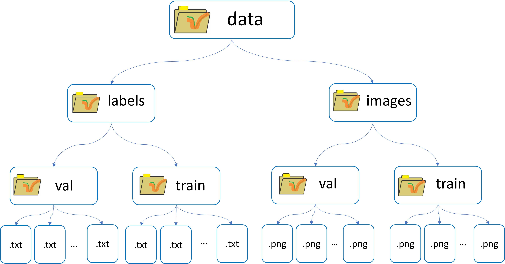

# <div align="center">Sistema de Conteo de Personas por Medio de Inteligencia Artificial</div>

Este sistema capaz de detectar y mantener una información cuantitativa de las personas que entran y salen de un establecimiento; Se implementa el algoritmo de YoloV5 junto a otras técnicas de visión artificial para determinar el aforo en un recito cerrado.

<div align="center">
  </a>
</div>


<details close>
<summary>Instalación</summary>

Clonar el repositorio e intalar [requerimientos.txt](https://github.com/gitale9/contadorDePersonasIA/blob/46df5e167f3178dfff1c16b0394ab6af7d24cd25/requerimientos.txt)
en un entrono [**Python 3**](https://www.python.org/)


```bash
git clone https://github.com/gitale9/contadorDePersonasIA.git # clonar repositorio
cd contadorDePersonasIA # ir a repositorio
pip install -r requerimientos.txt  # instalar requerimientos
```
</details>

<details close>
<summary>Ejecución</summary>

Se ejemplifican 3 formas de usar el sistema

* ### Demo
   Desde la terminal ejecute el siguiente comando
  ```bash
  Python contador_de_personas.py
  ```
    
* ### Vídeo propio
  Para pasar al algoritmo un vídeo propio, en el repositorio clonado guardar el vídeo con el nombre de "video_test.mp4" en la carpeta "video prueba", luego ejecutar el mismo comando del demo en la terminal.
  >***Nota:*** Si el vídeo propio está en un formato diferente, se debe convertir a "mp4"
  
* ### Cámara web (detección en tiempo real)
  Con un editor de texto abrir el archivo "contador_de_personas.py" que se encentra en este repositorio y cambiar la línea 22, como sigue:
  ```bash
  cap = cv2.VideoCapture('./video_prueba/video_test.mp4') # Esta es la línea actual, la que se va a reemplazar
  cap = cv2.VideoCapture(0) # Así debe quedar la línea para la detección en tiempo real con la cámara del dispositivo
  ```

  >***Nota:*** Lo que se está haciendo es cambiar el argumento de la función por cero, también se puede cambiar por la dirección (en comillas) de un vídeo propio.
  >> Si se establece en el argumento de la función la dirección de un nuevo vídeo este debe estar en formato "mp4"
  

  
</details>

<details close>
<summary>Entrenamiento</summary>
  
  El [entrenamiento](./Entrenamiento)
  se hace a partir una base de datos para generar un modelo de detección de personas; esto se hace con el fin de lograr mayor precisión, puesto que se entrena el algoritmo en el ambiente que se va a ejecutar, esta estrategia es una opción si se desarrolla para una tarea específica; como puede ser la determinacón del aforo en un supermercado en particular.

  
</details>

## Base de datos
* https://drive.google.com/drive/folders/1NggL7AcNG1_GGHBRocVCamX7GQkFuHfu?usp=sharing

  <details close>
  <summary>Estructura base de datos</summary>
     
  <div align="center">
    </a>
  </div>
  </details>


 


## Contacto

* Cristian de Jesús Bastidas Pedrozo. cristianbastidas41@gmail.com
  
* Jorge Alejandro Garzón Torres. alejorgt10@gmail.com 

* Yulieth Vanesa Rincon Saavedra. vanerincon7@gmail.com 
